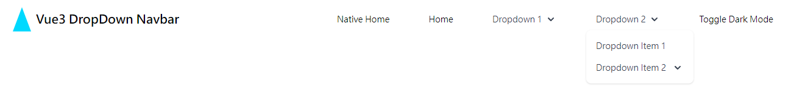
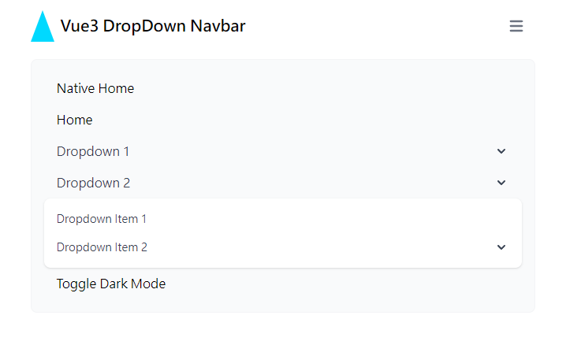

# vue3-dropdown-navbar

English｜[繁體中文](https://github.com/LaiJunBin/vue3-dropdown-navbar/blob/main/README.zh-tw.md#vue3-dropdown-navbar)

The package implements dropdown navbar, it based on Tailwind CSS.

[Demo Link](https://laijunbin.github.io/vue3-dropdown-navbar)

---

## Demo





---

## Install

```
$ npm install vue3-dropdown-navbar
```

---

## Usage

```html
<script setup lang="ts">
import {
  TheDropDownNavbar,
  TheDropDownMenu,
  TheDropDownItem,
  TheDropDownDivideBlock,
  TheDropDownNavbarLogo,
} from "vue3-dropdown-navbar";
import { ref } from "vue";

const dropdownMenu = ref<InstanceType<typeof TheDropDownMenu>>();
const toggleDarkMode = () => {
  document.documentElement.classList.toggle("dd-nav-dark");
};
</script>

<template>
  <TheDropDownNavbar>
    <template #logo>
      <TheDropDownNavbarLogo>Vue3 DropDown Navbar</TheDropDownNavbarLogo>
    </template>
    <TheDropDownItem link="/home">Home</TheDropDownItem>
    <TheDropDownMenu text="Dropdown 1" ref="dropdownMenu">
      <TheDropDownItem>Dropdown Item 1</TheDropDownItem>
      <TheDropDownItem>Dropdown Item 2</TheDropDownItem>
      <TheDropDownMenu text="Dropdown Item 3">
        <TheDropDownItem>Dropdown Item 3-1</TheDropDownItem>
        <TheDropDownItem>Dropdown Item 3-2</TheDropDownItem>
      </TheDropDownMenu>
      <TheDropDownDivideBlock>
        <TheDropDownItem>Sign out</TheDropDownItem>
      </TheDropDownDivideBlock>
    </TheDropDownMenu>
    <TheDropDownItem @click="toggleDarkMode">Toggle Dark Mode</TheDropDownItem>
  </TheDropDownNavbar>

  <button
    class="border bg-blue-500 text-white px-4 py-2 rounded-lg"
    @click="dropdownMenu?.openDropdownMenu"
  >
    Open Dropdown Menu
  </button>
</template>
```

Assume you have not installed TailwindCSS, you may reset the style, can import preflight in `main.(js|ts)`, it provides by Tailwind CSS.
```js
import { createApp } from "vue";
import App from "./App.vue";
// ...

import "vue3-dropdown-navbar/preflight.css"; // <-- Add this

const app = createApp(App);

app.use(router);

app.mount("#app");
```

---

## Property Description

if the suffix is (?), which is an optional property.

`TheDropDownNavbarLogo` component available properties:
Type  | Name           | Description  |
---------------|-----|---|
String | link?    | set link. |
String | imageUrl?    | set image url. |
String | alt?    | set image alt property. |
Boolean | native?    | set whether use native (&lt;a&gt;) link. |

`TheDropDownMenu` component available properties:
Type  | Name           | Description  |
---------------|-----|---|
String | text    | set text for dropdown menu. |
Boolean | closeOthers?    | set whether close other menus when open this menu. |

`TheDropDownItem` component available properties:
Type  | Name           | Description  |
---------------|-----|---|
String | link?    | set link. |
Boolean | native?    | set whether use native (&lt;a&gt;) link. |

---

## Function Description

`TheDropDownNavbar` component available function:
Name       | Description   |
----------------|----------|
closeAllDropdownMenu       | close all dropdown menus. |


`TheDropDownMenu` component available function:
Name       | Description   |
----------------|----------|
openDropdownMenu       | open this dropdown menu. |
closeDropdownMenu       | close this dropdown menu. |

---

## Extra Slot Description
`TheDropDownNavbar` component available slot:
Name       | Description   |
----------------|----------|
logo       | set navbar left side content, recommand using `TheDropDownNavbarLogo` component. |

---

## Common Attribute Description
Name       | Description   |
----------------|----------|
no-close-others       | by default, dropdown menu closes when clicking another element, if you want to click a specific element without closing dropdown menu, this can help you. |

Example

```html
<button no-close-others>Click Me Without Close Dropdown Menu</button>
```

---

## Dark Mode
Add `dd-nav-dark` class to &lt;html&gt; tag.

---
## Style CSP(Content Security Policy) Description
If your website has set CSP, you need to add the following settings:

```html
    <meta property="csp-nonce" content="<your-nonce>" />
```

The automatically injected style tag will add the `nonce` attribute.
