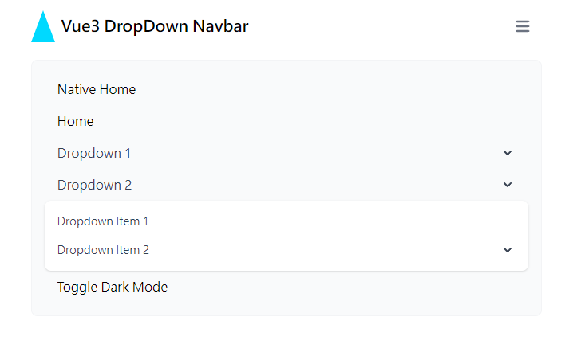

# vue3-dropdown-navbar

[English](https://github.com/LaiJunBin/vue3-dropdown-navbar#vue3-dropdown-navbar)｜繁體中文


這個套件實現具有下拉選單功能的導覽列(Navbar)，他基於 Tailwind CSS。

[Demo 連結](https://laijunbin.github.io/vue3-dropdown-navbar)

---

## Demo 圖片





---

## 安裝

```
$ npm install vue3-dropdown-navbar
```

---

## 使用

```html
<script setup lang="ts">
import {
  TheDropDownNavbar,
  TheDropDownMenu,
  TheDropDownItem,
  TheDropDownDivideBlock,
  TheDropDownNavbarLogo,
} from "vue3-dropdown-navbar";
import { ref } from "vue";

const dropdownMenu = ref<InstanceType<typeof TheDropDownMenu>>();
const toggleDarkMode = () => {
  document.documentElement.classList.toggle("dd-nav-dark");
};
</script>

<template>
  <TheDropDownNavbar>
    <template #logo>
      <TheDropDownNavbarLogo>Vue3 DropDown Navbar</TheDropDownNavbarLogo>
    </template>
    <TheDropDownItem link="/home">Home</TheDropDownItem>
    <TheDropDownMenu text="Dropdown 1" ref="dropdownMenu">
      <TheDropDownItem>Dropdown Item 1</TheDropDownItem>
      <TheDropDownItem>Dropdown Item 2</TheDropDownItem>
      <TheDropDownMenu text="Dropdown Item 3">
        <TheDropDownItem>Dropdown Item 3-1</TheDropDownItem>
        <TheDropDownItem>Dropdown Item 3-2</TheDropDownItem>
      </TheDropDownMenu>
      <TheDropDownDivideBlock>
        <TheDropDownItem>Sign out</TheDropDownItem>
      </TheDropDownDivideBlock>
    </TheDropDownMenu>
    <TheDropDownItem @click="toggleDarkMode">Toggle Dark Mode</TheDropDownItem>
  </TheDropDownNavbar>

  <button
    class="border bg-blue-500 text-white px-4 py-2 rounded-lg"
    @click="dropdownMenu?.openDropdownMenu"
  >
    Open Dropdown Menu
  </button>
</template>
```

假設你沒有安裝 TailwindCSS，需要重設(reset)他的樣式，可以在 `main.(js|ts)` 引入 Tailwind CSS 提供的 preflight。
```js
import { createApp } from "vue";
import App from "./App.vue";
// ...

import "vue3-dropdown-navbar/preflight.css"; // <-- 加入這行

const app = createApp(App);

app.use(router);

app.mount("#app");
```

---

## 屬性說明

名稱後面有個問號(?)，代表為非必要屬性(Optional)

`TheDropDownNavbarLogo` 組件可用的屬性：
類型  | 型別  | 名稱           | 描述  |
-----|----------------|-----|---|
屬性 | String | link?    | 設定連結 |
屬性 | String | imageUrl?    | 設定圖片的連結 |
屬性 | String | alt?    | 設定圖片的替代文字 |
屬性 | Boolean | native?    | 設定是否使用原生(&lt;a&gt;)連結 |

`TheDropDownMenu` 組件可用的屬性：
類型  | 型別  | 名稱           | 描述  |
-----|----------------|-----|---|
屬性 | String | text    | 設定下拉選單的文字 |
屬性 | Boolean | closeOthers?    | 設定當打開此選單是否關閉其他選單 |

`TheDropDownItem` 組件可用的屬性：
類型  | 型別  | 名稱           | 描述  |
-----|----------------|-----|---|
屬性 | String | link?    | 設定連結 |
屬性 | Boolean | native?    | 設定是否使用原生(&lt;a&gt;)連結 |

---

## 方法說明

`TheDropDownNavbar` 組件提供的方法：
名稱       | 描述   |
----------------|----------|
closeAllDropdownMenu       | 關閉所有打開的下拉選單 |


`TheDropDownMenu` 組件提供的方法：
名稱       | 描述   |
----------------|----------|
openDropdownMenu       | 開啟下拉選單 |
closeDropdownMenu       | 關閉下拉選單 |

---

## 額外 `Slot` 說明
`TheDropDownNavbar` 組件提供的 Slot:
名稱       | 描述   |
----------------|----------|
logo       | 設定 `Navbar` 左側顯示的內容，可與 `TheDropDownNavbarLogo` 組件搭配使用 |

---

## 共通屬性說明
名稱       | 描述   |
----------------|----------|
no-close-others       | 因為預設下拉選單會在你點擊其他元素之後關閉，如果你希望點擊特定元素不要把選單關閉，可以使用這個屬性 |

使用範例

```html
<button no-close-others>點我不會關閉選單</button>
```

---
## 深色模式
為 &lt;html&gt; 標籤加入 `dd-nav-dark` 類別。
